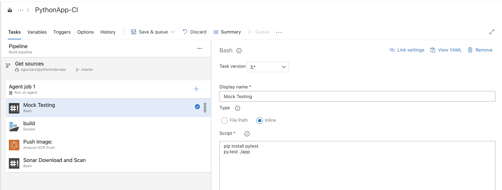

# Build Pipeline Testing | PyTEST

## ```PyTEST```

> ```PyTEST :``` Yazdığımız python uygulamasını fonksiyonel olarak test eder. Örnek olarak; bir api yazdık "/hc" path'e istek attığımızda 200 dönecek ya da response data "ok" dönecek gibi kontrolleri yapıyor. 



