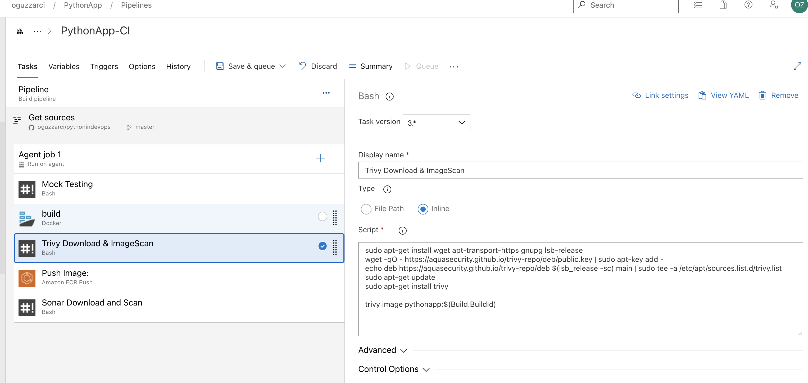
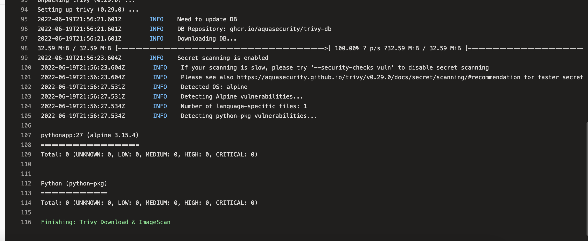

# Build Pipeline Testing | Trivy

## ```Trivy```

> ```Trivy :``` Oluşturduğumuz docker image'larını test eder. Herhangi bir paket eski mi yeni mi ya da güvenlik açığı var mı gibi kontrolleri vardır.



