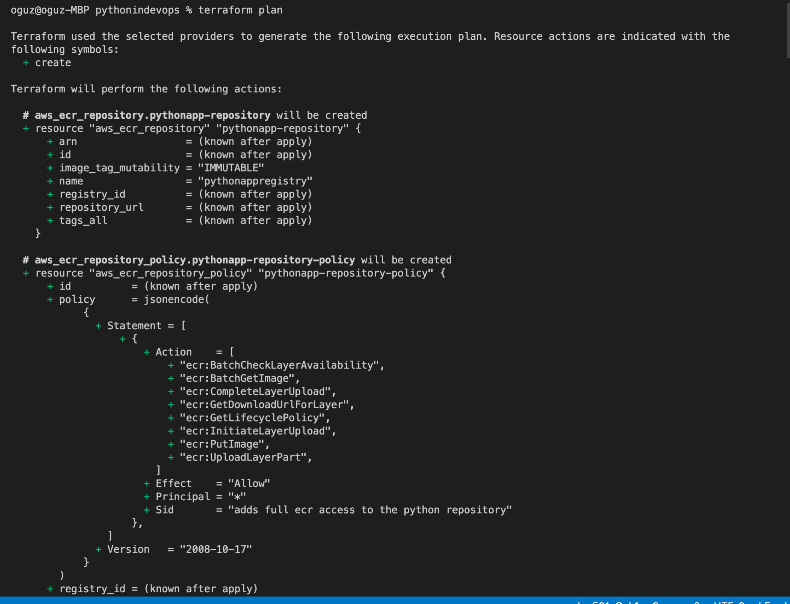
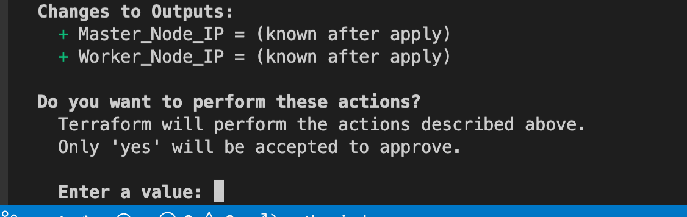
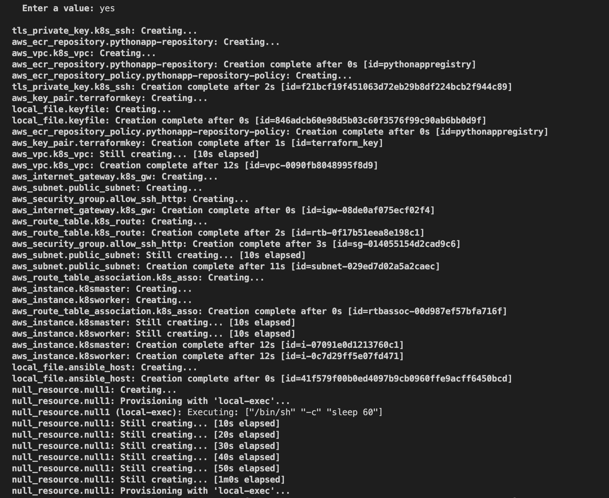
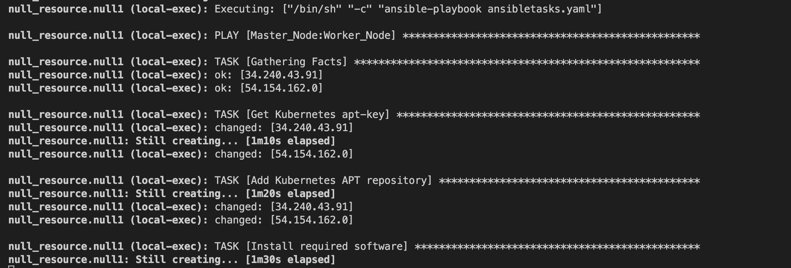
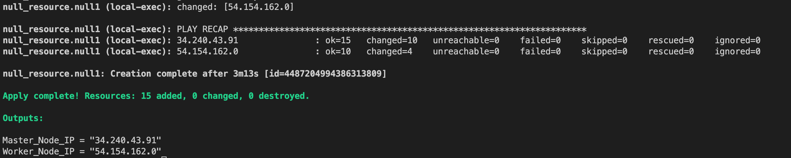
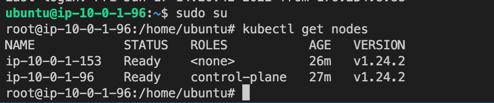
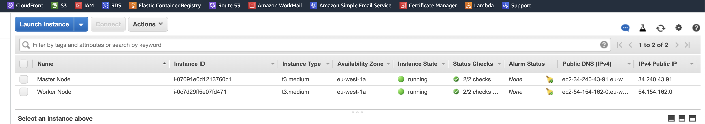
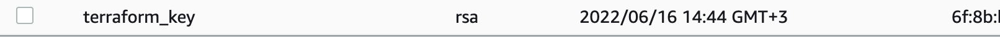
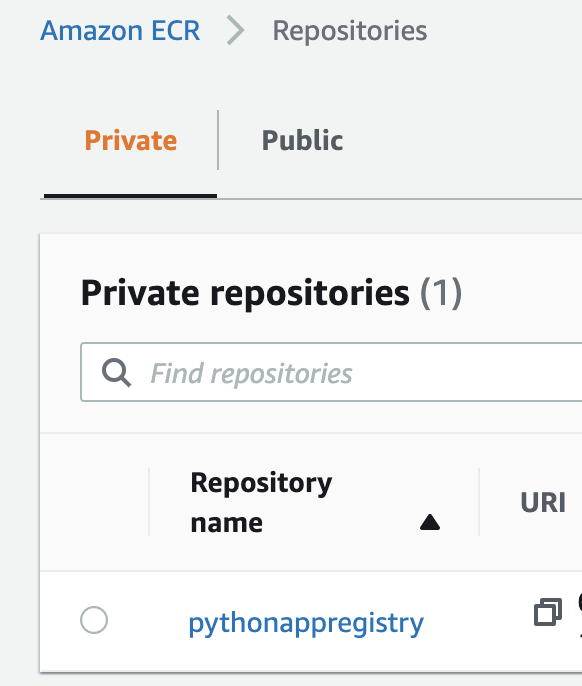

# SETUP
> Terraform scriptlerimizin olduğu yerde aşağıdaki komutları sırasıyla çalıştıracağız.
- terraform init
- terraform validate
- terraform plan
- terraform appy ve terraform apply --auto-approve

<br /><br />

### ``` terrraform init : ``` Scriptlerimizde kullandığımız modülleri indiriyor. Örnek olarak; npm install


<br /><br />

### ```  terraform validate :```  Yazdığımız scriptlerde herhangi bir hata olup olmadığını kontrol ediyoruz.


<br /><br />

### ``` terraform plan :``` Terraform'un bizim için neler oluşturacağını görüyoruz. Oluşturmadan önce kontrol edebiliyoruz.



<br /><br />

### ``` terraform apply :``` Bu komut ile tüm resource'lar oluşmaya başlayacaktır. Ama sizden bir onay isteyecektir. yes diyerek devam edebilirsiniz.



<br /><br />

### ``` terraform apply --auto--approve :``` Bu komut ile tüm resource'lar oluşmaya başlayacaktır. Sizden onay beklemez ve tüm resource'lar oluşmaya başlar.
<br /><br />


<br /><br />

> ```terraform apply```'dan sonra ```yes``` diyerek kurulumlara başlıyoruz.


Aşağıdaki görüntüde terraform master ve worker node'ları oluşturdu. local-exec adıma geldi burada da ansible scriptimizi tetikleyecek.


<br /><br />

```Ansible``` çalışarak node'lara gerekli kurulumları yapıyor.



<br /><br />

Kurulumlar tamamlandı ve output olarak tanımladığımız Master ve Worker node'larının public ip'leri döndü. Terraform toplamda 15 tane resource oluşturuğunu bilgisinide veriyor.



<br /><br />

# SSH MASTER NODE

Terraform output olarak bize Master ve Worker node'ların public ip'leri veriyor. Oluşturduğumuz .pem dosyası ile bu sunuculara kolaylıkla ssh ile bağlanabiliriz.

Aşağıdaki ssh komutu ile sunucuya bağlanalım.
<br /><br />
```sh
ssh -i terraform_key.pem ubuntu@PUBLIC_IP
```
<br /><br />

<br /><br />
Kurulumları root kullanıcı ile yaptığımız için ilk olarak root kullanıcına geçmemiz gerekiyor. Daha sonra ```kubectl get nodes``` diyerek kontrollerimizi gerçekleştiriyoruz.
<br /><br />


<br /><br />
Kubernetes kurulumumuz sorunsuz bir şekilde tamamlanmış.

<br /><br />

# Oluşan Resource'lar
>EC2


>VPC


>Subnet


>Security Group


>Key pair


>Amazon Elastic Container Registry (ECR)
