# AZURE DEVOPS İLE CI/CD
### Gereksinimler
- Microsof Hesabı(adiniz@hotmail.com vs)

<br /><br />

## ```Build Pipeline```

> Kodlarımız github'da olacak, build alıp AWS ECR'a pushlayacağız. ```BuildId``` ile uygulamamızı versiyonlayacağız.

### Aşamalar
- AzureDevOps'da proje açılması
- Aws için service connection girilmesi
- Docker Build
- ECR Push

---

<br /><br />
```AzureDevOps'da proje açılması```
> Sol üstte New project butonuna tıkladıktan sonra proje ismini belirleyip oluşturuyoruz. 


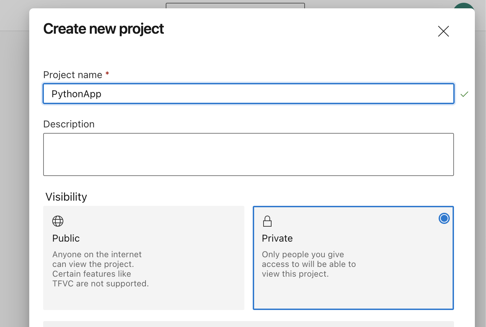

<br /><br />

```Aws için service connection girilmesi```
> Oluşturduğumuz projeye tıkladıktan sonra sol alttan Project settings daha sonra Service connection'u seçiyoruz.

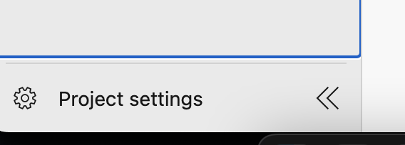

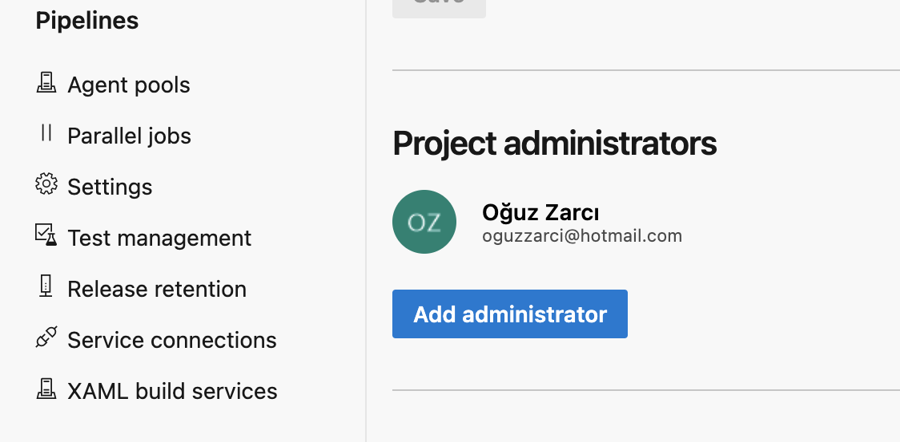


> Aşağıdaki gibi eğer AWS seçeneği görünmüyorsa AWS plugin'i yüklenmesi gerekiyor. Aşağıdaki adımları izleyerek hızlıca yükleyebilirsiniz.

1. Organization settings
2. Extensions
3. Browse marketplace
4. Search AWS

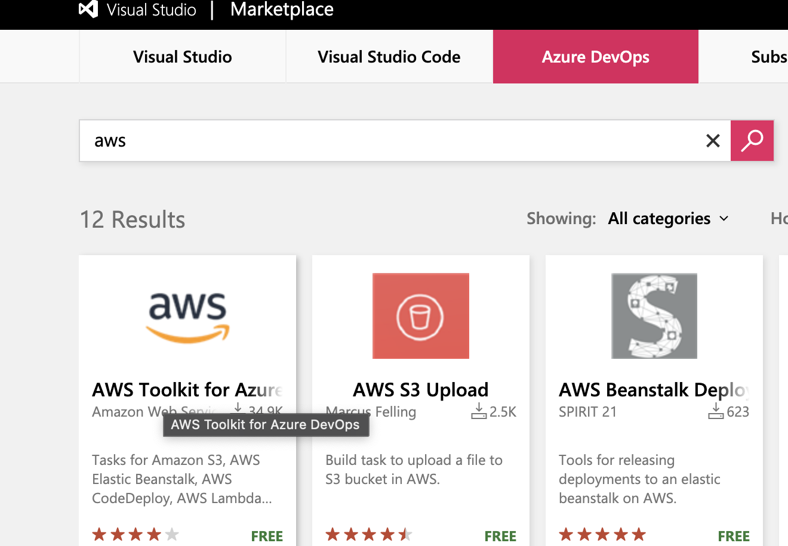

5. Plugin'e tıkladıktan sonra ```Get it free ```diyerek devam ediyoruz.

Eklemek istediğimiz organizasyonu seçecerek ``ìnstall`` diyerek devam ediyoruz.

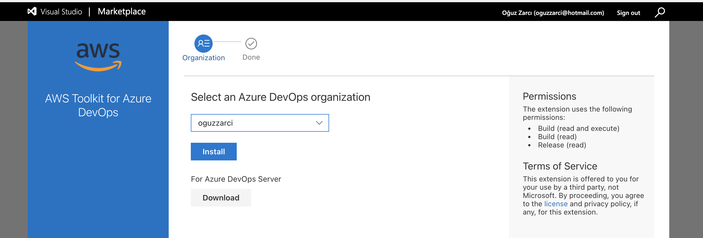


<br /><br />

> Service connection ekranına tekrar geldiğinizde AWS seçeneğinin geldiğini göreceksiniz.


Next diyerek ilerlediğimizde sizden ```Access Key ID```, ```Secret Access Key``` ve ```Service connection name``` isteyecek. Bu alanlar zorunludur.

AWS IAM üzerinden ECR'da full yetkili bir kullanıcı oluşturduktan sonra bu kullanıcının bilgilerini kullanabilirsiniz. 

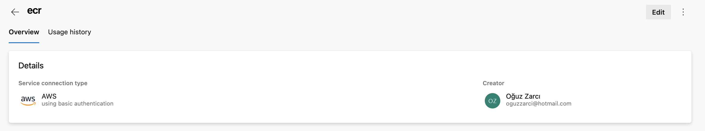

<br /><br />

```Docker Build```
> Proje sayfasında sol sekmede bulunan Pipelines kısmından Create Pipeline diyerek yeni bir pipeline oluşturuyoruz.

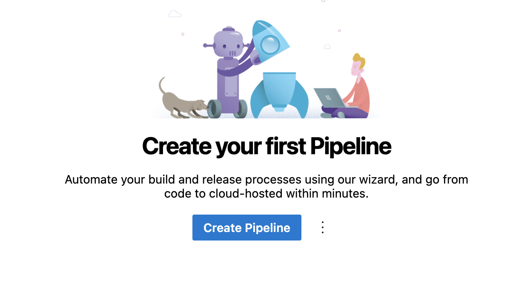

Kodlarımız github da olacağı için aşağıdaki ```Authorize using OAuth```butonuna tıklayarak gerekli yetkileri tanımlıyoruz.


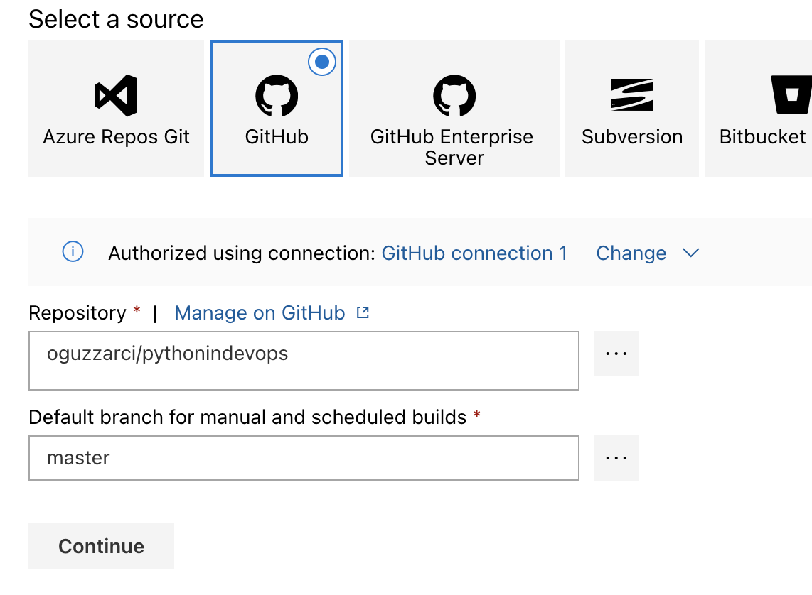

Continue diyerek devam ediyoruz.
```Select a template``` kısmı için Empty Job diyerek devam ediyoruz.

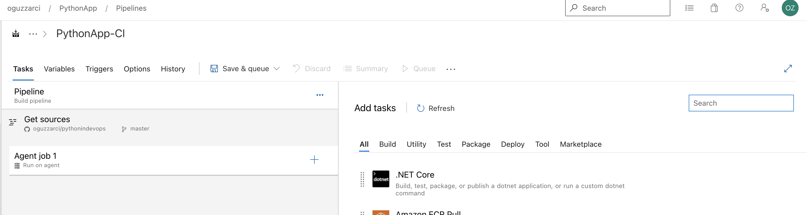

Yukarıdaki ekranı gördükten sonra soldan Docker ve Amazon ECR Push pluginlerini ekliyoruz.

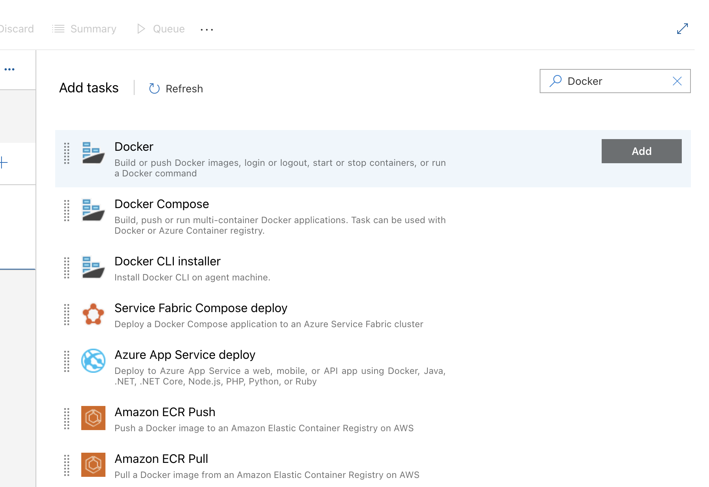

Ekledikten sonra aşağıdaki gibi pipeline'mızı düzenliyoruz.

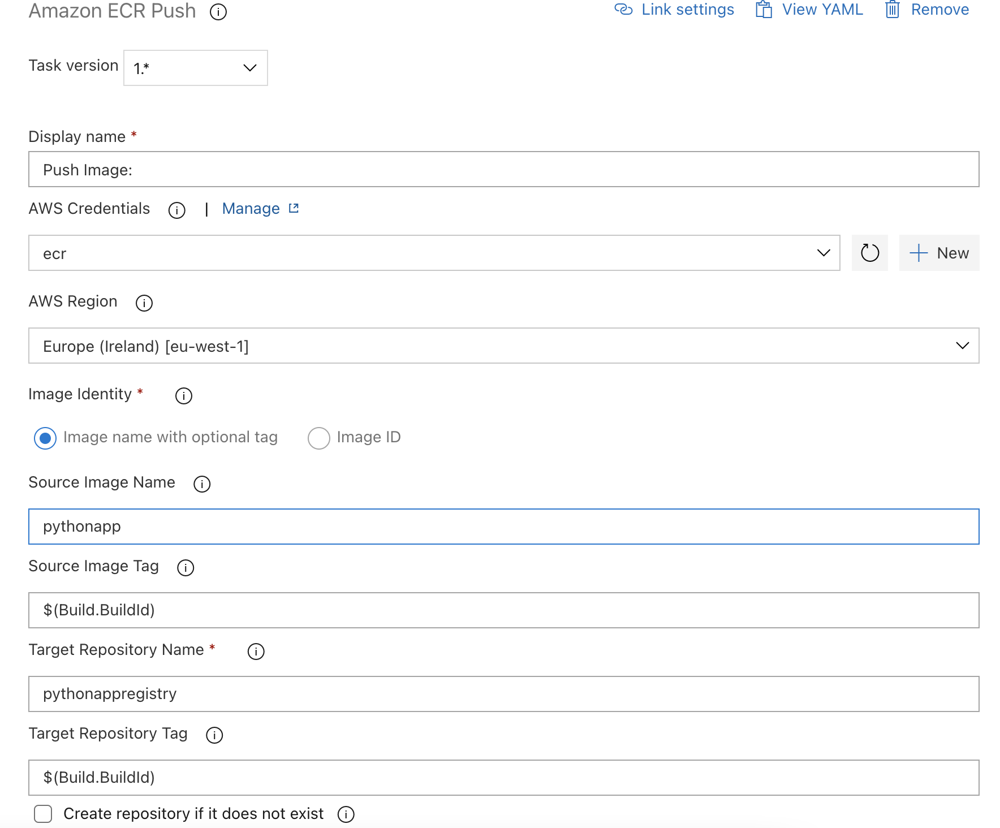

> Build almak için yukarıdaki Save & queue diyerek ilk build'mizi başlatıyoruz.


Build başarılı bir şekilde çalıştı ve ECR'a pushladık.


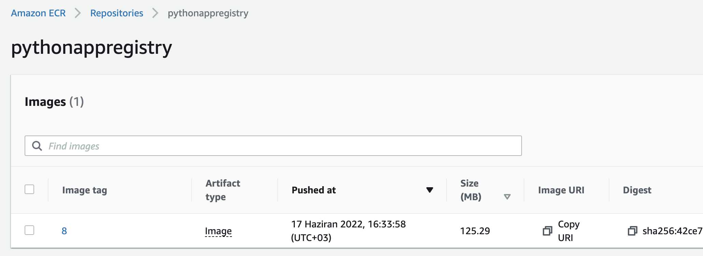

> Kodumuza her push çıktığımızda build almasını istiyorsak aşağıdaki gibi ```trigger```'ı açmamız gerekiyor.


<br /><br />


### ```Sonar Cloud Entegrasyonu```

>[SonarCloud](https://sonarcloud.io/)'ta hesap oluşturduktan sonra proje oluşturuyoruz.


>Aşağıdaki gibi sonarcloud projemizi pipeline'a nasıl ekleyeceğimizi gösteriyor. Gösterdiği komutları bir bash scripti olarak pipeline'a ekliyoruz.

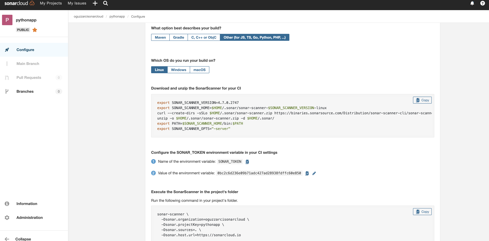

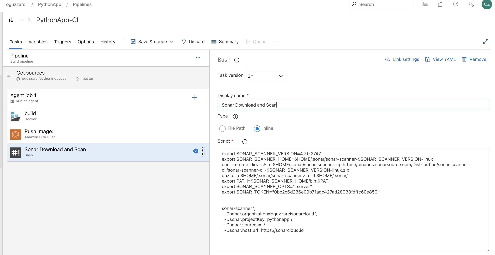

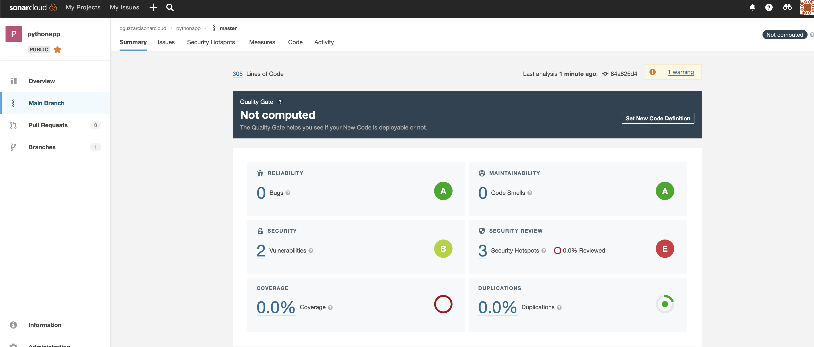