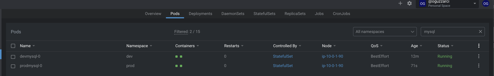
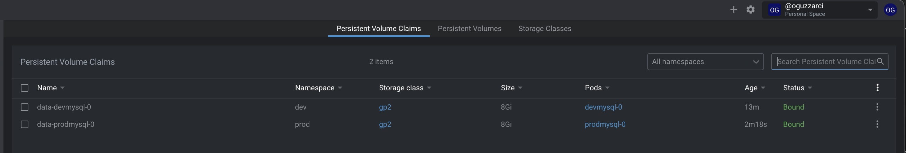
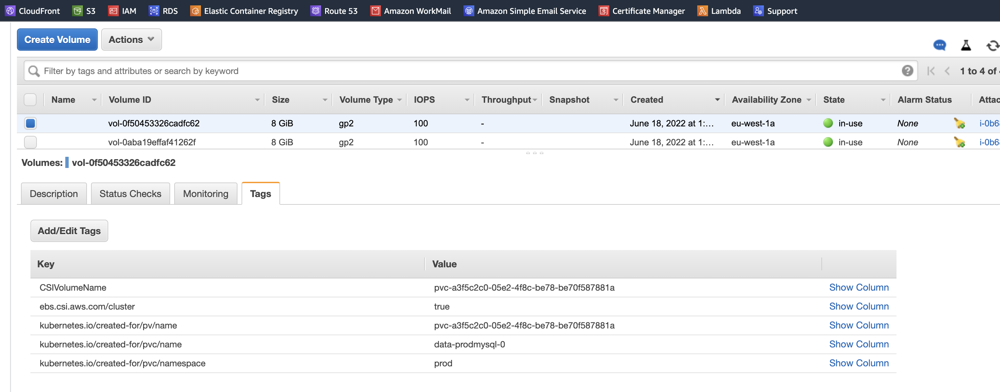

# Deploying MySQL on Kubernetes


Mysql kurulumlarını genel olarak [Bitnami'nin helm paketini](https://bitnami.com/stack/mysql/helm) kullanıyorum. Kurulumu oldukça kolay.

### Gereksinimler
- Helm
- Kubectl
- Kubernetes Cluster

Aşağıdaki adımları takip ederek kurulumu yapalım. Burada iki tane mysql kuracağız. Hem dev hemde prod namespace'lerine.

```sh
helm repo add bitnami https://charts.bitnami.com/bitnami
```

```sh
helm install devmysql bitnami/mysql --set metrics.enabled=true --set namespaceOverride=dev
```

```sh
helm install prodmysql bitnami/mysql --set metrics.enabled=true --set namespaceOverride=prod
```

Her kurulumda metricleri mutlaka açıp Grafana ile monitör ediyorum.

Kurulumumuz tamamlandı.


<br/>

Mysql'lerimizin persistent volumleride oluşturuldu. Pod'lar kapanıp açılsa bile datalarımız kaybolmayacak.

## ```MySQL PODS ```


<br/>

## ```MySQL Persistent Volumes ```

<br/>

## ```MySQL Persistent Volume Claims ```

<br/>

## ```AWS Volumes ```


<br/><br/>

> Kubernetes IDE olarak [LENS](https://k8slens.dev/) kullanıyorum. Yukarıdaki görüntüler lens'in dashboard'undan.