## ```Release Pipeline```

> Build pipelineda uygulamamızı ```BuildId``` versiyonlamıştık. Şimdi bu ```BuildId```  göre kubernetes ortamına deploy yapacağız Aşağıdaki adımları takip ederek başlayalım.

1. AzureDevOps'a kubernetes service connection girilmesi.
2. BuildId için pipeline Variable group oluşturulması.
3. [Replace Tokens](https://marketplace.visualstudio.com/items?itemName=qetza.replacetokens) extensions yüklenmesi.
4. Dev ve Prod Stage'lerinin kurulması.
5. Prod ortamı için Pre-deployment approvals adımının tanımlanması. Prod ortamına bizim onayımız olmadan çıkmayacak.

### ```AzureDevOps'a kubernetes service connection girilmesi.```
> Ansible bizim için kubernetes config dosyasını local bilgisayarımıza indiriyordu. Projemizin service connections bölümünden kubernetes'i bulalım. Next diyerek devam edelim.

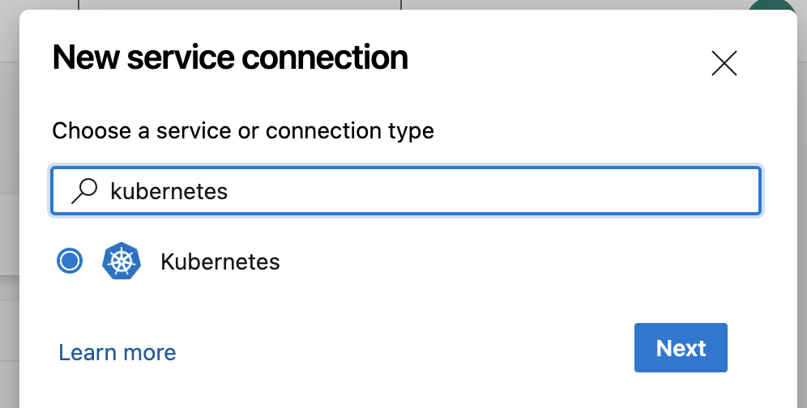

> admin.conf dosyamızının içeriğini aşağıdaki gibi kopyalayıp ve Service connection name vererek kaydedelim. Burada server master sunucumuzun private ip'si olacaktır. Onu putput'ta gelen master sunucumuzun public ip'si ile değiştirelim.

<br/>

### ```NOT :``` Local bilgisayarınızda bu config dosyası ile işlem yaptığınız da Certificate hatası alırsanız aşağıdaki komutu çalıştırarak bu hatayı ignore edebilirsiniz.
```sh
kubectl config set-cluster kubernetes --insecure-skip-tls-verify=true
```

<br/>

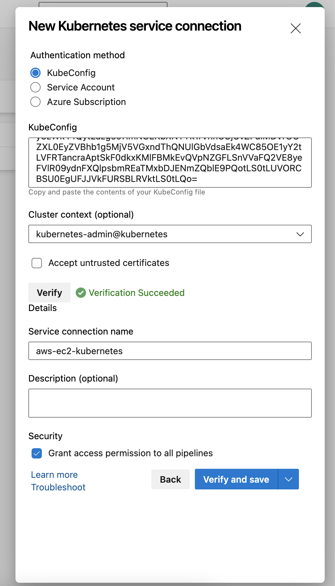


### ```BuildId için pipeline Variable group oluşturulması.```
> Build ve release pipeline'ı farkı olduğu için ortak bir variable group oluştuğ BuildId'sini kullanmalarını sağlıyoruz.

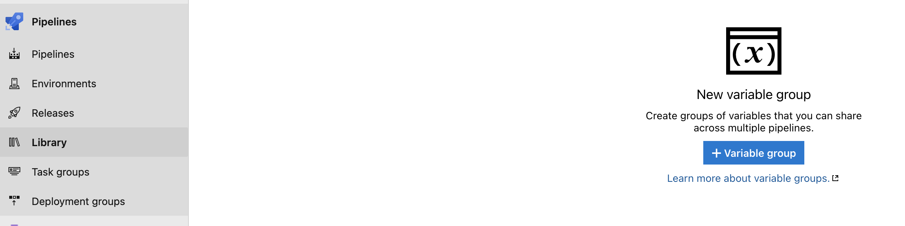

| Name | Value |
| ------ | ------ |
| buildId | $(Build.BuildId) |

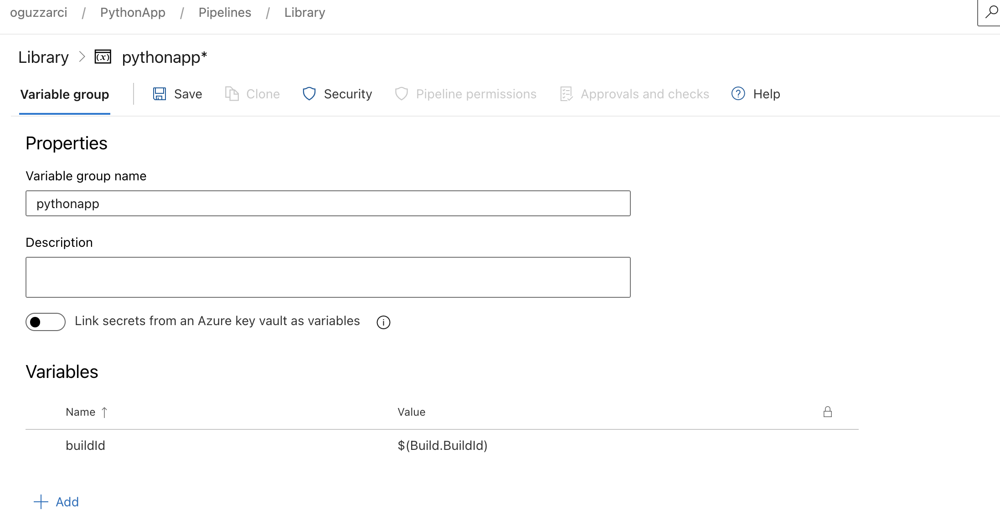

### ```Replace Tokens extensions yüklenmesi.```
> AWS extension'nı yüklediğimiz gibi yüklüyoruz.


### ```Dev ve Prod Stage'lerinin kurulması```

> Proje sayfasında sol sekmede bulunan Pipelines Release kısmından Create Pipeline diyerek yeni bir pipeline oluşturuyoruz. Empty job diyerek devam ediyoruz.


> Sol tarafta bulunan ```Artifacts``` hem build pipeli'nı hemde Helm chart'm repoda olduğu için kodlarımızın oldu repoyu ekliyorum.

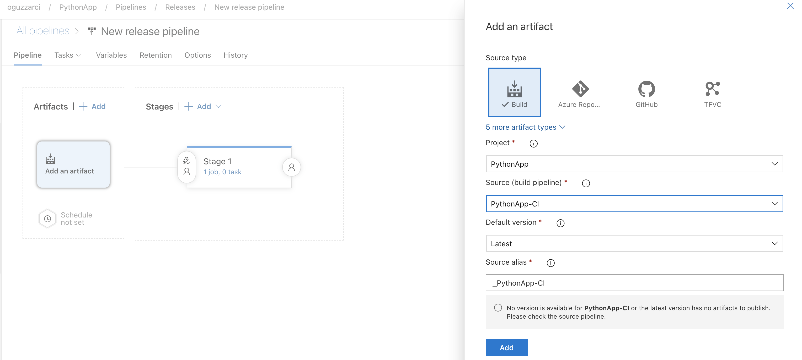

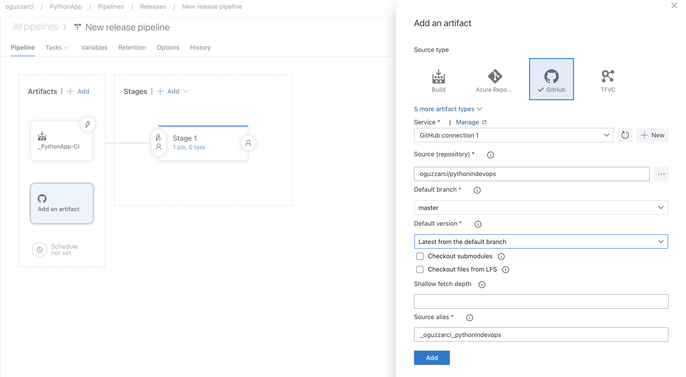

>Oluşturduğumuz Variable Group'u ekliyoruz.

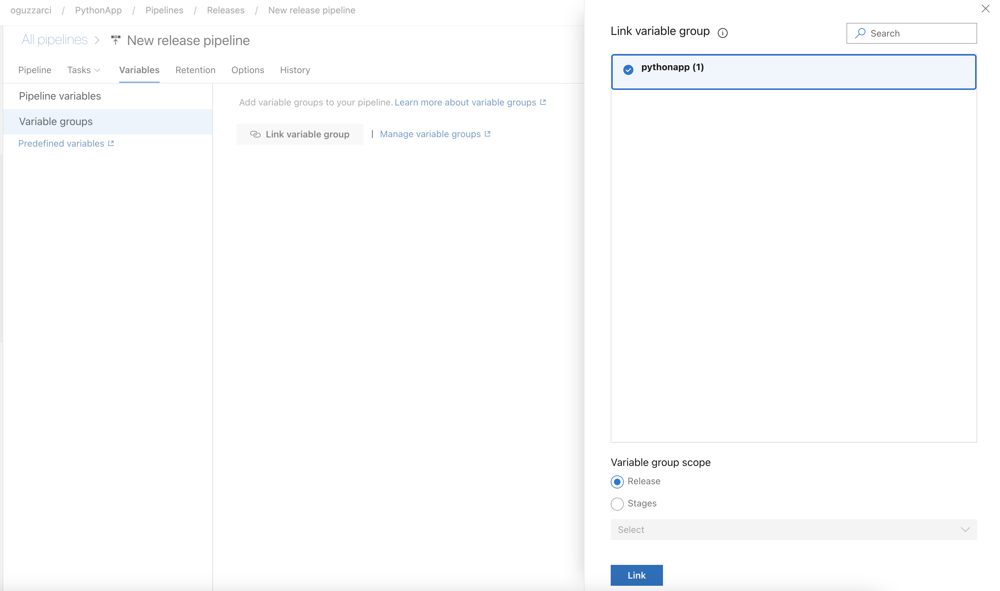

> Hem başarılı build alındığında Release Pipeli tetiklenmesini istiyorsak aşağıdaki trigger'ı açmamız gerekiyor

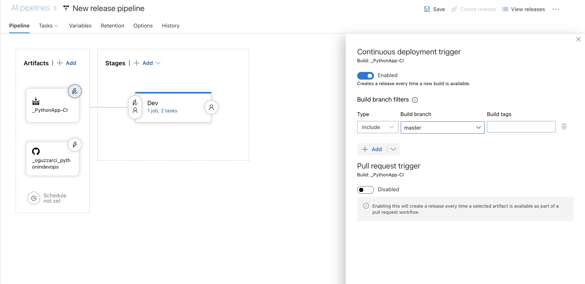

> Pipeline aşağıdaki gibi;

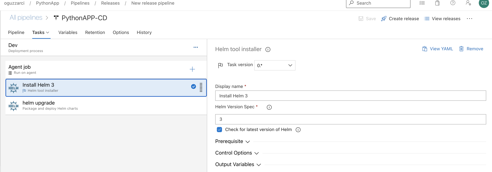
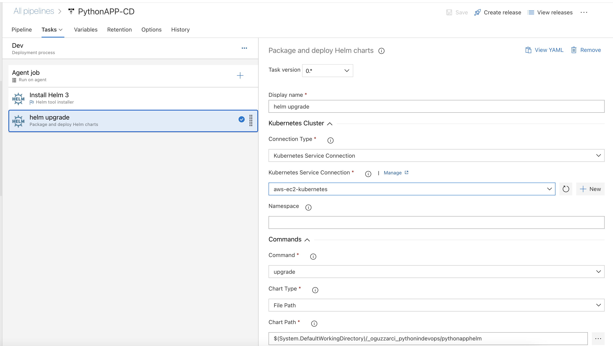


<br/><br/>
#### Yeni bir build başlattım. Build başarılı bir şekilde tamamlanırsa Release pipeline tetiklenerek dev ortamına yeni versiyonu deploy edecek.
<br/>

```Build Başarılı```
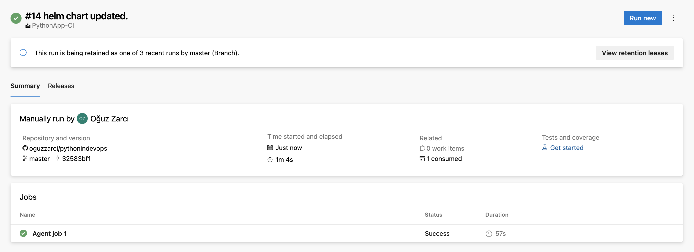

<br/><br/>

```Deploy Başarılı```


<br/><br/>

```Yeni Versiyon```


>Prod Stage'i kurmak için Dev Stage'i clone diyerek kurabiliriz. Stage adını ve chart ismini güncellememiz gerekiyor.


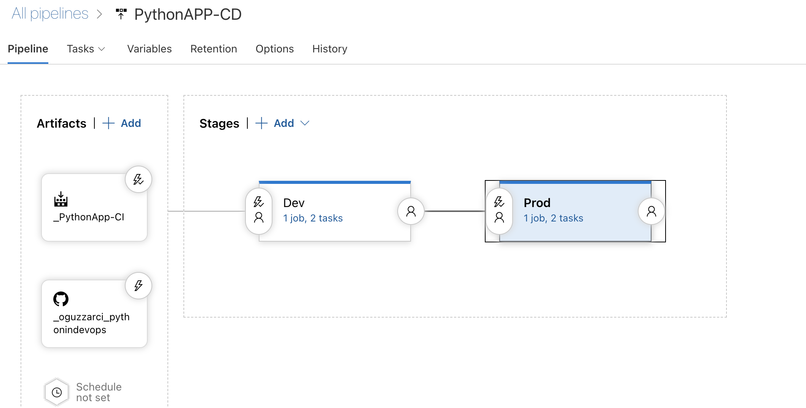

<br/><br/>

### ```Prod ortamı için Pre-deployment approvals adımının tanımlanması```

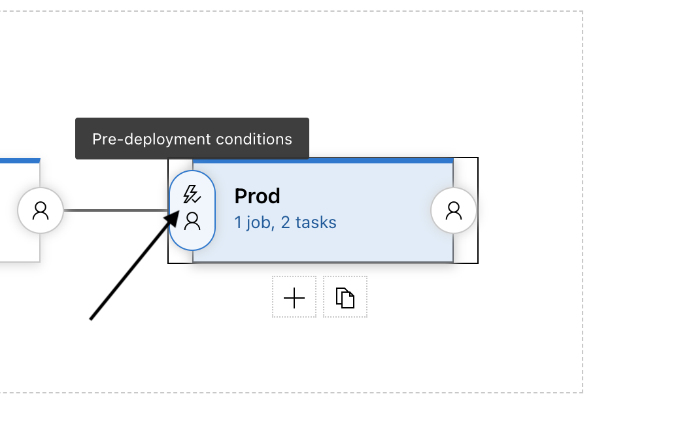

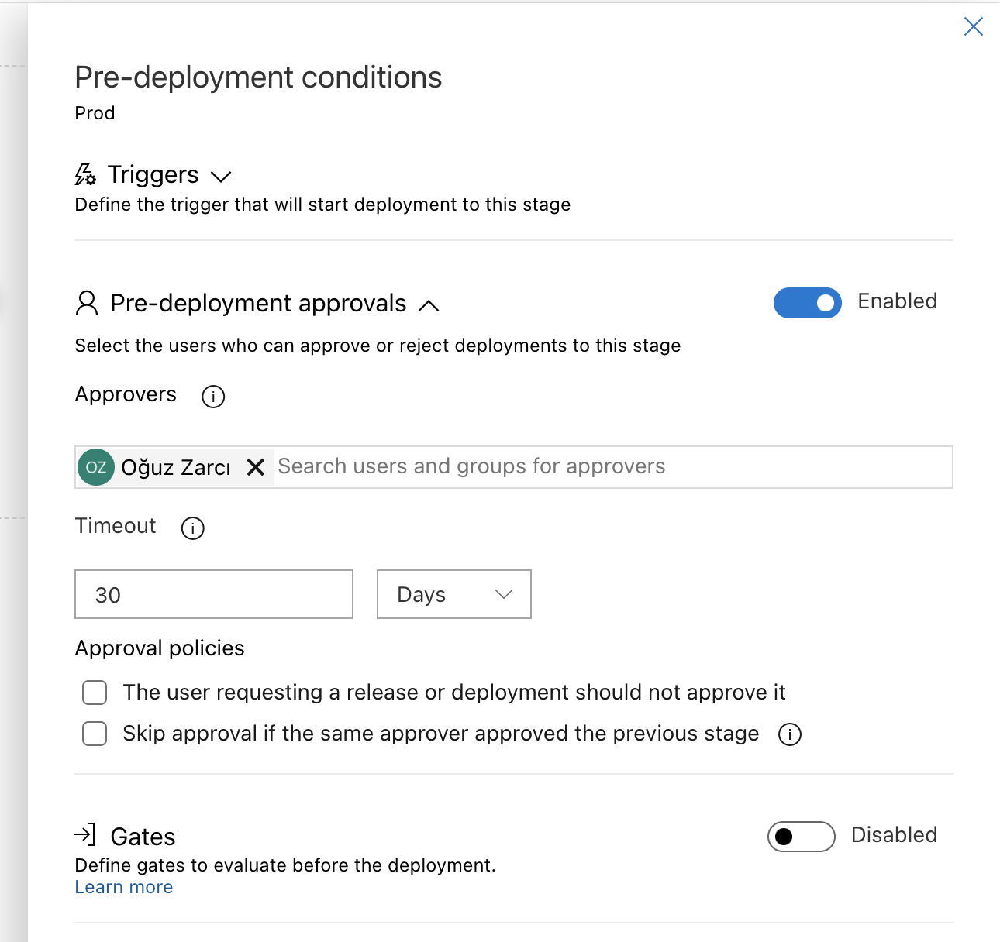

Artık Prod ortamına deploy çıkarken benim onayım alınacak.


> Böyle bir durumda microsof size mail'de atıyor.


