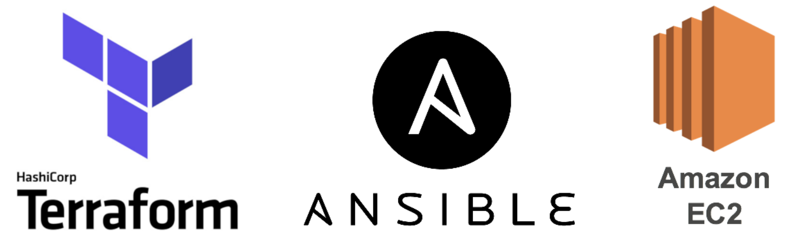

# Python Simple App Deploy Kubernetes

> Python web uygulamamızı deploy edeceğiz. Terraform ile AWS'de Master ve Worker olacak şekilde 2 tane EC2 ayağa kaldıracağız. Daha sonra bu EC2'lara ansible yardımı ile kubernetes'i kuracağız.



# Gereksinimler
- Terraform
- Ansible
- Aws Account
- AwsCLI
- Helm3

## Python Uygulamasının Dockerize Edilmesi
```docker
FROM python:alpine3.15
RUN mkdir /app
WORKDIR /app

RUN apk update \
    && apk add --virtual build-deps gcc python3-dev musl-dev \
    && apk add --no-cache mariadb-dev

COPY requirements.txt requirements.txt
RUN pip3 install -r requirements.txt
RUN apk del build-deps
COPY . .
#CMD ["python", "app.py"]
RUN chmod +x ./entrypoint.sh
ENTRYPOINT ["./entrypoint.sh"]
```

- ## requirements.txt

Bu dosyada uygulamamızın ihtiyaç duyduğu paketleri alt alta yazıyor. pip3 komutu tek tek okuyup bizim için indiriyor.

- ## Gunicorn
Python ile yazılmış bir WSGI HTTP server. Dinamik içerik söz konusu olduğunda Apache’ye göre daha lightweight bir web server olduğu için performansı daha yüksek. Daha fazla detay için http://gunicorn.org/

----

### İlk build sırasında aşağıdaki hatayla karşılaştım. Bunu için Dockerfile'da değişiklik yapmam gerekti.

```diff
- #9 4.532 Collecting mysqlclient                                                             
- #9 4.572   Downloading mysqlclient-2.1.0.tar.gz (87 kB)
- #9 4.589      ━━━━━━━━━━━━━━━━━━━━━━━━━━━━━━━━━━━━━━━━ 87.6/87.6 KB 6.1 MB/s eta 0:00:00
- #9 4.624   Preparing metadata (setup.py): started
- #9 5.102   Preparing metadata (setup.py): finished with status 'error'
- #9 5.110   error: subprocess-exited-with-error
- #9 5.110   
- #9 5.110   × python setup.py egg_info did not run successfully.
- #9 5.110   │ exit code: 1
- #9 5.110   ╰─> [16 lines of output]
- #9 5.110       /bin/sh: mysql_config: not found
- #9 5.110       /bin/sh: mariadb_config: not found
- #9 5.110       /bin/sh: mysql_config: not found
- #9 5.110       Traceback (most recent call last):
- #9 5.110         File "<string>", line 2, in <module>
- #9 5.110         File "<pip-setuptools-caller>", line 34, in <module>
- #9 5.110         File "/tmp/pip-install-_4a3fl2d/mysqlclient_ab08a5bdc80e4db0ad0b0d86569c9ced/setup.py", line 15, in <module>
- #9 5.110           metadata, options = get_config()
- #9 5.110         File "/tmp/pip-install-_4a3fl2d/mysqlclient_ab08a5bdc80e4db0ad0b0d86569c9ced/setup_posix.py", line 70, in get_config
- #9 5.110           libs = mysql_config("libs")
- #9 5.110         File "/tmp/pip-install-_4a3fl2d/mysqlclient_ab08a5bdc80e4db0ad0b0d86569c9ced/setup_posix.py", line 31, in mysql_config
- #9 5.110           raise OSError("{} not found".format(_mysql_config_path))
- #9 5.110       OSError: mysql_config not found
- #9 5.110       mysql_config --version
- #9 5.110       mariadb_config --version
- #9 5.110       mysql_config --libs
- #9 5.110       [end of output]
- #9 5.110   
- #9 5.110   note: This error originates from a subprocess, and is likely not a problem with pip.
- #9 5.113 error: metadata-generation-failed
```

### Aşağıdaki kod blogunu ekleyerek build alabildim.
```diff
+ RUN apk update \
+   && apk add --virtual build-deps gcc python3-dev musl-dev \
+    && apk add --no-cache mariadb-dev
+ RUN apk del build-deps
```

----

Gunicorn ile uygulamayı ayağa kaldırmak için aşağıdaki entrypoint.sh dosyasını oluşturdum ve executable yetkisi olan chmod +x verdim.

```sh
#!/bin/sh
gunicorn app:application -w 4 --threads 2 -b 0.0.0.0:3000
```