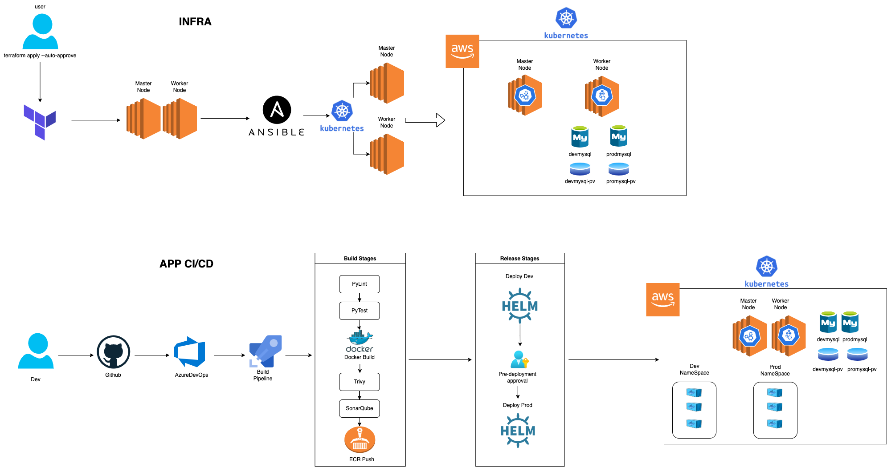

# Python Simple App Deploy Kubernetes

> Python web uygulamamızı deploy edeceğiz. Terraform ile AWS'de Master ve Worker olacak şekilde 2 tane EC2 ayağa kaldıracağız. Daha sonra bu EC2'lara ansible yardımı ile kubernetes'i kuracağız.

<br /><br />

<br /><br />
# Gereksinimler
- Terraform
- Ansible
- Aws Account
- AwsCLI
- Helm3
<br /><br />


---
## Tüm içerikler

1. [Python Uygulamasının Dockerize Edilmesi](https://github.com/oguzzarci/pythonindevops/blob/master/1-DockerizeApp.md)
2. [Terraform](https://github.com/oguzzarci/pythonindevops/blob/master/2-Terraform.md)
3. [Terraform Apply](https://github.com/oguzzarci/pythonindevops/blob/master/3-TerraformApply.md)
4. [Ansible](https://github.com/oguzzarci/pythonindevops/blob/master/4-Ansible.md)
5. [Aws Storage Class](https://github.com/oguzzarci/pythonindevops/blob/master/5-AwsStorageClass.md)
6. [AZURE DEVOPS İLE CI/CD | Build Pipeline](https://github.com/oguzzarci/pythonindevops/blob/master/6-BuildPipeline.md)
7. [Deploying MySQL on Kubernetes](https://github.com/oguzzarci/pythonindevops/blob/master/7-DeployMysql.md)
8. [Helm İle İlk Deploy | Helm Chart](https://github.com/oguzzarci/pythonindevops/blob/master/8-Helm.md)
9. [AZURE DEVOPS İLE CI/CD | Release Pipeline](https://github.com/oguzzarci/pythonindevops/blob/master/9-ReleasePipeline.md)
10. [Build Pipeline Testing | Pylint](https://github.com/oguzzarci/pythonindevops/blob/master/10-Pylint.md)
11. [Build Pipeline Testing | PyTEST](https://github.com/oguzzarci/pythonindevops/blob/master/11-Pytest.md)
12. [Build Pipeline Testing | Trivy](https://github.com/oguzzarci/pythonindevops/blob/master/12-Trivy.md)
13. [Azure DevOps Pipelines Export](https://github.com/oguzzarci/pythonindevops/tree/master/AzureDevOps)

---

# Hızlı Kurulum
>Kubernetes ortamının ve mysqllerin kurulması için aşağıdaki komutları çalıştabilirsiniz.
```sh
git clone https://github.com/oguzzarci/pythonindevops.git
cd pythonindevops
# INFRA
sh infrasetup.sh
# Note: ansible klasörünün altında oluşan admin.cof dosyasını $HOME/.kube/ altında config olarak atmalısınız.
# !!! config dosyasınızın yedeğini almayı unutmayın !!!
# MYSQL
sh allmysqlinstall.sh
# Note: Certificate hatası alıyorsanız bknz: https://github.com/oguzzarci/pythonindevops/blob/master/9-ReleasePipeline.md
```

# Filmlerdeki Kırmızı Buton :)
>Kurduğumuz herşeyi aşağıdaki komutla silebiliriz.
```sh
#DESTROY
sh destroy.sh
```
<br/>

# Altyapı diyagramı ve CI/CD Yapısı



---

## Önerilen Kaynaklar

- <https://aquasecurity.github.io/trivy/v0.29.0/>
- <https://docs.pytest.org/en/7.1.x/>
- <https://pypi.org/project/pylint/>
- <https://bitnami.com/stack/mysql/helm>
- <https://k8slens.dev/>
